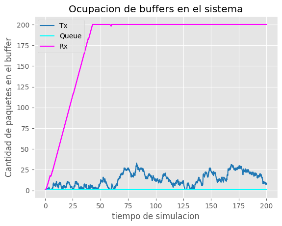
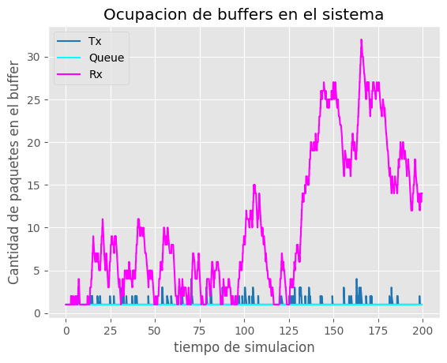
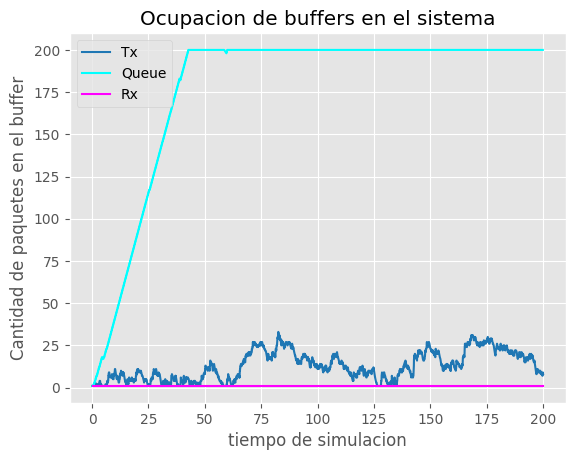
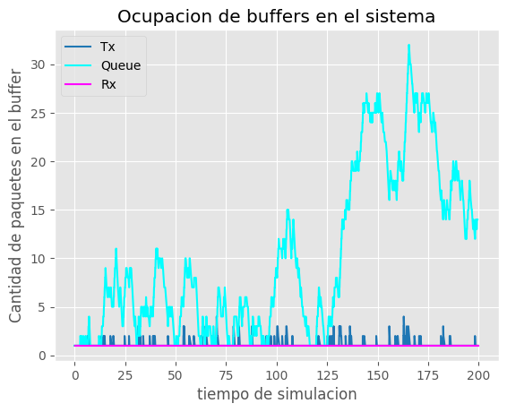
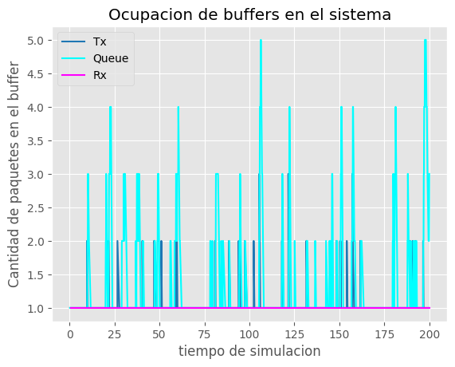
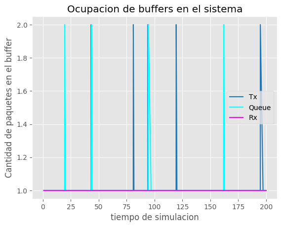
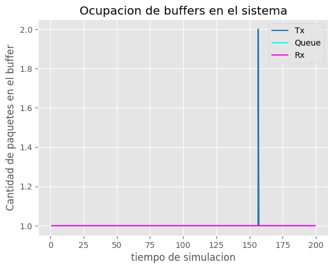

FALTA PASARLE UNA CORREGIDA POR CHAT PARA LA ORTOGRAFIA Y TODA LA WEA :)

# Analisis de flujo y congestion de redes utilizando simulacion discreta

---

## Resumen Abstracto:
**dos parrafos de resumen del trabajo y los resultados**

Se nos proporcionó por la catedra un kickstarter de modelo de colas con un generador, una cola y un consumidor. Nuestra primer tarea fue realizar los cambios al codigo para transformar este modelo a uno que tenga en cuenta el tamaño de los paquetes y los buffers (tanto en los hosts como en los nodos intermedios). Y se nos plantearon dos casos a analziar:
	- Caso 1 (**Flujo**): La velocidad para procesar los paquetes entrantes del nuevo consumidor (NodeRx) es menor a la velocidad a la que el nuevo nodo generador (NodeTx) le envía.
	- Caso 2 (**Congestion**): La velocidad y la capacidad de carga de la subred, representada por Queue, limita la cantidad de paquetes.
	En ambos casos ocurre la perdida de paquetes.

2) Para solucionar este problema implementamos una mejora que consiste en que el host emisor "detecte" cuando se esté saturando y así avisar al host emisor para que disminuya la velocidad a la que envía paquetes. Para el Caso 2 funciona de manera similar, pero esta vez el notifica la saturación es la red.

# explicar que hicimos
---

## Introducción: 
**definimos el problemas (congestion y flujo). Referencias a otros articulos que abordan el mismo problema**

Primero veamos bien de que se trata los problemas de congestión y flujo. Cabe destacar que si bien estos problemas no son tratados únicamente por la capa de transporte, nos vamos a centrar en su mayoría en los aspectos del problema en dicha capa.

El problema de flujo se refiere al caso donde un host transmisor rápido sobrecarga aun host receptor lento. Este problema se trata también en la capa de enlace, pero de una manera distinta, ya que esta capa se encarga de 'proteger' los paquetes mientras viajan a traves de un enlace y no mientras se encuantran dentro de un router. A nivel de capa de transporte nos interesa la fiabilidad de los datos, tratando de manejar la perdida y corrupción de paquetes se entreguen.

Para verificar la entrega de paquetes se hace uso de los ACK (Acknowledgment) para verificar la llegada de los paquetes, temporizadores para saber cuanto tiempo esperar a la recepción de los ACK y buffers para poder guardar los paquetes enviado y recibidos. 

Existen dos tipos de control de flujo: control de flujo basado en créditos y control de flujo basado en retroalimentación. El control de flujo basado en créditos implica que el receptor envíe un mensaje al transmisor cuando esté listo para recibir más datos. El transmisor solo envía datos cuando recibe este mensaje. El control de flujo basado en retroalimentación implica que el receptor envíe un mensaje al transmisor indicando cuántos datos puede recibir en ese momento.

Por otro lado, la congestión es un problema que es manejado también por capa de transporte, pero mayoritariamente por la capa de red. La congestión en la red puede ocurrir cuando hay demasiados datos que intentan pasar por una parte de la red. Cuando esto sucede, los paquetes de datos pueden perderse o retrasarse, lo que puede afectar negativamente la eficiencia y el rendimiento de la red. Cuando una subred se encuentra congestionada lo que queremos hacer es bajar el flujo que mandamos por esa subred para descongestionar, o aumentar la capacidad de carga de esa subred.

Hay muchos enfoques a la hora de resolver este problema. Podemos mejorar los enlaces que son saturados frecuentemente (provisioning), también podemos adaptar las rutas a los patrones de tráfico (traffic-aware routing). Y si no es posible aumentar la capacidad de la subred una solución puede ser, por ejemplo en TCP, algunos host disminuirán la tasa de datos, por eso los host tiene mecanismos para detectar congestión.

**El control de congestión se puede lograr mediante técnicas como control de congestión explícito e implícito. El control de congestión explícito implica que el receptor envíe un mensaje al transmisor indicando que la red está congestionada y que debe reducir la velocidad de envío de datos. El control de congestión implícito implica que el transmisor monitorea la congestión en la red y ajusta su velocidad de envío de datos en consecuencia.**

A nivel de capa de transporte existen varios algoritmos para manejar el problema, por ejemplo TCP Talhoe, o TCP Reno. Este último se trata de, una vez iniciada la conexión, se manda paquetes de forma exponencial hasta llegar a un umbral cierta cantidad de paquetes enviados, a partir de ese umbral se envian paquetes de con incrementos lineales. Cuando pierda paquetes (TCP asume que 3 acks duplicados implican una perdida de paquete) se fija el umbral a la mitad y se vuelve a enviar paquetes de forma lineal, esto se sigue repitiendo.

---

## Marco metodologico : 
**como vamos a trabajar con nuestro estudio (simulacion discreta). Q es, como se trabaja, ventajas y desventajas, que se propone hacer.**

En este proyecto utilizamos Omnet++ para simular un modelo de colas y analizar la pérdida de paquetes en redes de comunicaciones. 
Omnet++ es un entorno de simulación de sistemas de eventos discretos basado en C++ y utilizado para simular redes informáticas y otros sistemad distribuidos, la razón del por qué usar Omnet++ es que al tratar de modelar y estudiar problemas de red en capas inferiores (transporte, red y enlace) sería muy complicado la tarea de análisis y desarrollo de la aplicación en si, por esto es que nos apoyamos en Omnet++. Para entender mejor cómo funcion la simulación, es importante conocer algunos conceptos básicos sobre la simulación discreta.

La simulación discreta es una técnica utilizada para modelar y analizar sistemas dinámicos, en donde el tiempo se avanza en forma discreta, es decir, por medio de eventos que ocurren en momentos específicos del tiempo. Esto no da la posibilidad de estudiar en que ocurre entre estos eventos en nuestro sistema, por ejemplo si definimos nuestros eventos a un micro segundo de distancia, sería muy difícil estudiar que sucede dentro de un procesador en esos intervalos, sin embargo en, nuestra simulación podríamos tomarnos mucho tiempo y cómputo entre estos intervalos para saber que sucede en el sistema. Esto nos permite un alto nivel de detalle a la hora de análisis. Inversamente también nos facilita el estudio en modelos donde los eventos se distancian por un gran intervalo.

En nuestro sistema el tiempo de simulación avanza por medio de una cola de eventos de distintos tipos (por ejemplo de eventos de arribo, partida, servicio, etc). El estado del sistema puede cambiar entre eventos, los eventos pueden crear otros y agregarlos en la cola en algun tiempo determinado. 

|                           Ventajas                           |                         Desventajas                          |
| :----------------------------------------------------------: | :----------------------------------------------------------: |
| **Flexibilidad:** Los modelos de simulación de eventos discretos son muy flexibles y pueden adaptarse fácilmente a una amplia variedad de sistemas y situaciones. Pueden modelar eventos y procesos complejos en detalle. | **Complejidad del desarrollo:** El desarrollo de un modelo de simulación de eventos discretos puede ser complejo y requerir un conocimiento profundo del sistema que se está modelando. Requiere la especificación detallada de entidades, eventos, interacciones y reglas de comportamiento. Notar que la precisión de los resultados dependerá en gran medida de la calidad del modelo utilizado, por lo que es importante asegurarse de que este sea lo más fiel posible al sistema real. |
| **Representación detallada del sistema:** Estos modelos pueden representar con precisión los detalles y la complejidad de un sistema. Pueden incluir múltiples entidades, interacciones entre ellas, recursos, eventos y variables que cambian con el tiempo. | **Recursos computacionales:** Los modelos de simulación de eventos discretos pueden requerir una gran cantidad de recursos computacionales, especialmente cuando se simulan sistemas complejos y grandes. Esto puede afectar la velocidad de ejecución y requerir hardware potente para obtener resultados en un tiempo razonable. |
| **Experimentación y análisis:** La simulación de eventos discretos permite realizar experimentos en un entorno controlado y reproducible. Esto permite probar diferentes configuraciones, estrategias y políticas sin afectar el sistema real. Además, proporciona una base sólida para el análisis de resultados y la toma de decisiones informada. | **Validación y verificación:** La validación y verificación de un modelo de simulación de eventos discretos puede ser un desafío. Es necesario asegurarse de que el modelo refleje con precisión el sistema real y de que los resultados de la simulación sean confiables y representativos. |
| **Escalabilidad:** Estos modelos son escalables y pueden adaptarse a sistemas de diferentes tamaños y complejidades. Pueden simular desde sistemas pequeños hasta sistemas extremadamente grandes y complejos, lo que los hace adecuados para una amplia gama de aplicaciones. | **Limitaciones en la representación del tiempo:** Algunos modelos de simulación de eventos discretos pueden tener limitaciones en la representación del tiempo. Por ejemplo, pueden no capturar adecuadamente eventos simultáneos o eventos que ocurren en intervalos de tiempo muy cortos. |
| **Visualización y comprensión:** Los modelos de simulación de eventos discretos a menudo ofrecen herramientas de visualización que permiten observar la simulación en tiempo real. Esto facilita la comprensión del comportamiento del sistema y la identificación de posibles cuellos de botella o áreas problemáticas. |                                                              |

En este proyecto se nos proporciona un kickstarter de un modelo de colas sencillo, en el cual contamos con un módulo *Generador*, una *Cola* y un *Consumidor*. En primera instancia se nos pide cambiar este modelo para que sea más completo y tenga en cuenta la nocion de capacidad, es decir la tasa de transferencia de datos y la memoria de los buffers. 

Agregamos dos nuevos módulos, cada uno compuesto del módulo Generador y Consumidor anteriores. y modificaos la *Network* en base a estos nuevos cambios. Los casos de estudio que se explicarán en detalle más adelante se ajustan en el nuevo nodo Consumidor y en la red.
Luego de analizar los datos en este modelo. Tendremos que implementar nuevas mejoras para diseñar un sistema de control de flujo y congestión entre el consumidor y el generador, para evitar la pérdida de datos por la saturacion de los buffers. Las modificaciones serán detalladas más adelante.

---

## Presentacion de Casos describiendo modelos (con graficas)
**Reordenar o chequear el orden de la pregunta y respuesta**

- Que diferencia observa entre el caso de estudio 1 y 2? Cual es la fuente limitante en cada uno? Investigue sobre la diferencia entre control de flujo y control de congestion (Figura 6-22 Tanenbaum)

​	En el caso 1 de estudio, se presenta un problema de control de flujo. Esto se debe a que el host receptor tiene poca capacidad para manejar los paquetes que le envía el productor. Dicho de otra forma, podemos considerar al *Sink* como un proceso encargado de manejar los paquetes que llegan, y en este caso particular, el proceso es lento en comparación con el proceso del generador, es decir, el host emisor. Como resultado, el host receptor o sink pierde paquetes cuando su búfer se llena y no puede almacenar nuevos paquetes entrantes.

​	Por otro lado, en el caso 2 de estudio, el problema es de congestión. El emisor tiene una alta capacidad de producción, pero la capacidad de carga de la subred no puede soportar este tráfico de datos. El nodo Queue no dispone de suficiente capacidad para almacenar y procesar los paquetes enviados por NodeTx. Por lo tanto, se produce pérdida de paquetes en Queue.

​	En este contexto, una subred se refiere a un conjunto de dispositivos interconectados que actúan como intermediarios en la comunicación entre diferentes host emisores y receptores, y que tienen una determinad capacidad de carga que puede verse afectada por la congestión.

​	Ambos problemas llevan al mismo resultado, la pérdida de paquetes. Pero podemos observar que la razón, y en algunos casos la solución, no es la misma. En la imagen podemos ver una representación de ambos problemas. Donde el dibujo **a)** representa el problema de flujo del caso 1 y el **b)** el problema de congestión del caso 2. Podemos decir que la diferencia fundamental entre estos casos es que el problema de control de flujo se refiere a la velocidad a la que se envían los datos, mientras que el control de congestión se refiere al manejo del tráfico en una red para evitar la congestión.
​	En la simulación realizada en Omnet++, se puede observar este comportamiento a través de las estadísticas proporcionadas por la simulación. Los siguientes gráficos muestran la evolución de la ocupación de cada uno de los buffers a medida que transcurre el tiempo.

​	Para realizar un análisis adecuado de los gráficos, es necesario tener en cuenta los valores utilizados en la simulación para el tamaño de los buffers. Todas las muestras de esta investigación se tomaron con un tamaño de buffer de 200 para los nodos Rx y la Queue intermediaria que conecta los nodos Rx y Tx. Además, se utilizó un tamaño de buffer de 2,000,000 para el nodo emisor (Tx), ya que nuestro objetivo se centra en el estudio de los buffers de los otros nodos de la red y no nos interesa analizar el caso en el que se sature el nodo emisor.

​	Los gráficos se generaron con intervalos de generación exponencial (x) con x en el rango de [0.1, 0.2, 0.3, 0.6, 1], respectivamente.

​	El intervalo de generación es el parámetro que utiliza el host emisor como "velocidad de generación" de los paquetes que serán enviados a través de la red.

### Caso 1 : Problema de flujo

  

​	En el primer gráfico, correspondiente a un intervalo de generación seleccionado mediante números aleatorios generados por la función exponencial con un valor centrado en 0.1, se puede observar claramente un problema de flujo. El nodo Rx alcanza su capacidad máxima de 200 paquetes en buffer aproximadamente entre el segundo 35 y 45 de nuestra simulación. Una vez que el buffer llega a su capacidad máxima, comenzamos a perder paquetes. Dado que en el modelo original no se notifica esta situación, el generador continúa enviando paquetes al mismo ritmo, los cuales se pierden en la red y son descartados, ya que no hay suficiente espacio para almacenarlos.

  
  

  
  

​	Los gráficos correspondientes a la simulación con intervalos de generación de paquetes seleccionados a través de la función exponencial centrada en 0.2, 0.3, 0.6 y 1 no son tan relevantes para el análisis, ya que en estos casos ningún buffer alcanza su capacidad máxima y no se producen pérdidas de paquetes. Sin embargo, podemos observar que a medida que el intervalo de generación es más largo en tiempo, la ocupación de los buffers disminuye. Esto se debe a que las tareas de almacenamiento y reenvío se realizan a un ritmo que evita la acumulación excesiva de paquetes en los buffers de los nodos más lentos, en este caso del nodo Rx.

### Caso 2: Problema de congestión 

​	El análisis es similar al del caso uno, pero con la salvedad de que ahora el nodo que se ve sobrepasado por la carga que transita en la red es el nodo Queue, que vendría a ser la subred que conecta los nodos Tx y Rx.

​	De manera equivalente al caso analizado anteriormente, el primer gráfico es el de mayor valor analítico, ya que podemos observar cómo el nodo Queue se satura aproximadamente en el segundo 40 de nuestra simulación y comienza a perder paquetes. De manera similar, en el resto de los gráficos podemos observar que a medida que el intervalo de generación es más largo en tiempo, la ocupación de los buffers disminuye, ya que las tareas de almacenamiento y reenvío se realizan a un ritmo que evita la acumulación excesiva de paquetes en los buffers, especialmente en los nodos más lentos, en este caso, el nodo Queue.

  

  
  

  
  

### Análisis transversales a ambos casos:

​	Para comprender mejor el comportamiento de nuestra red, generamos dos gráficos que son comunes a ambos casos de estudio: "Carga útil vs carga ofrecida" y "Delay". Ambos gráficos fueron generados a partir de coordenadas (x,y) obtenidas al repetir la simulación 5 veces con intervalos de generación obtenidos de números aleatorios generados por la función exponencial centrada en 0.1, 0.2, 0.3, 0.6 y 1, respectivamente. Veamos cada uno de ellos en detalle y analicemos la información que nos brindan:

1. ​	Gráfico de Carga útil vs carga ofrecida: Este gráfico nos muestra la relación entre la carga útil, es decir, la cantidad de paquetes que llegan efectivamente al sink o nodo receptor, y la carga ofrecida, que representa la cantidad total de paquetes generados por el emisor que van a ser enviados por la red hacia el receptor.

​	Podemos observar que cuando la carga ofrecida se acerca a los 1000 paquetes, nuestra función, que 	venía siendo lineal hasta este punto, cambia su comportamiento y genera un nuevo tramo donde todavía tenemos una función lineal, pero con una tasa de crecimiento mucho menor. Esto sucede porque en este punto comenzamos a perder paquetes. Podemos notar que la carga ofrecida en este segundo tramo varía desde aproximadamente 1000 hasta 2000 paquetes, mientras que la carga útil no llega a superar los 1000 paquetes. La información que nos proporciona este análisis es que la diferencia entre la cantidad de paquetes en el eje x y la cantidad de paquetes en el eje y representa los paquetes que se están perdiendo debido a algún buffer saturado en la red. Siguiendo la informacion que nos proporcionaron los graficos sobre tamaño del buffer en el tiempo anteriormente anteriormente, sabemos que esto ocurre en el nodo receptor (Rx) en el caso 1 y en el nodo Queue (subred) en el caso 2.

2. ​	Delay: Este gráfico muestra la relación entre la carga ofrecida, es decir la cantidad total de paquetes generados por el emisor y enviados a través de la red hacia el receptor, y el retardo por simulación. El retardo por simulación se refiere al promedio, en segundos, de la diferencia de tiempo entre el envío de un paquete hacia la subred mediante el emisor hasta su llegada efectiva al nodo receptor.

​	En este caso, también es evidente que existe un punto de inflexión cerca de los 1000 paquetes de carga ofrecida. Este comportamiento se debe a la pérdida de paquetes mencionada anteriormente. Cuando un paquete se pierde según nuestro modelo, el tiempo registrado entre su envío y llegada tiende a infinito, ya que nunca llegará (a menos que sea retransmitido por el emisor, pero este problema de retransmisión corresponde a la capa de transporte, la cual no es relevante en este proyecto). Sin embargo, debemos considerar que en nuestra simulación, esta "infinitud" está limitada por un tiempo máximo de simulación de 200 segundos, por lo que ese valor representa el infinito dentro de nuestro entorno de simulación.A medida que aumenta la carga útil y se pierden más paquetes en la red, el promedio del tiempo de retardo se ve cada vez más afectado, con valores de delay que rondan los 200 segundos, lo que incrementa el promedio general.

​	Además, se puede observar que desde los 200 hasta los 1000 paquetes ofrecidos (aproximadamente), también hay un aumento en el eje y. Esto se debe a que, aunque aún no se están perdiendo paquetes, el tiempo que tardan en llegar los paquetes aumenta cuando deben ser almacenados y esperar su turno para ser enviados, lo cual es un comportamiento típico de un buffer que tiene al menos un paquete encolado.

​	Conociendo en detalle los problemas planteados por la simulación y los comportamientos que deseamos evitar, propondremos un algoritmo para mejorar la red. Luego generaremos gráficas similares para analizar los resultados de este cambio, con la expectativa de reducir la pérdida de paquetes y mantener un tiempo de entrega razonable para los paquetes.

---

## Metodo: 

**Chequear donde incluir la pregunta y como organizarlo**
- Como cree que se comporta su algoritmo de control de flujo y congestion? Funciona para el caso de estudio 1 y 2 por igual? Por que?

 En caso de implementar control de flujo y control en una sola estrategia, se recomienda evaluar el
sistema con un tamaño de buffer de 100 paquetes en la queue conectando el transmisor y receptor. Este
escenario permitirá estudiar el algoritmo con ambas funcionalidades operando simultáneamente.

describe el algoritmo que queremos implementar para resolver estos conflictos de flujo y congestion. Y pq creemos que lo solucionara

---

## Resultados:

detalle de los resultados de los algoritmos diseñados y una pequeña conclusion.

​	Luego de implementar el algoritmo, generamos nuevamente las estadísticas utilizando las mismas configuraciones que en el caso inicial. Esto nos permite tener una representación gráfica de los cambios en el comportamiento de la red de manera más sencilla y visual.

​	Analicemos los resultados...

### Caso 1: Problema de flujo

#### Análisis de "Ocupación de los buffers en el sistema"

  

​	Una vez más, el caso más interesante de analizar es aquel correspondiente a un intervalo de generación que se basa en la función exponencial centrada en 0.1. Según los análisis detallados en la sección [Presentación de Casos describiendo modelos (con gráficas)] (ENLACE A LA SECCIÓN), sabemos que nuestro problema en cuanto a control de flujo se producia cuando el nodo Rx superaba su capacidad máxima de almacenamiento en el buffer, que es de 200 paquetes. En el gráfico, podemos observar que esta situación ya no ocurre, ya que mediante un mecanismo de control, el nodo Rx es capaz de enviar un mensaje al nodo generador (Tx) solicitando que disminuya la velocidad de envío de paquetes. De esta manera, el nodo Rx tiene tiempo suficiente para descongestionarse antes de perder paquetes.

​	También se puede observar que, al llegar a un punto en el que el buffer no está cerca de colapsar y ha tenido tiempo de descongestionarse durante unos 30 a 40 segundos aproximadamente, se comienza a enviar paquetes más rápidamente y la ocupacion del buffer Rx comienza a aumentar ligeramente. Esta situación se produce porque el nodo Rx también notifica cuando tiene capacidad para recibir paquetes más rápidamente, en un intento de mitigar el problema de la demora  excesiva en la entrega de los paquetes.

​	Puede resultar extraño para el lector el comportamiento del buffer del nodo Tx. Recordemos que en este análisis proponemos un tamaño de buffer que podría considerarse "infinito" en términos de la cantidad de paquetes que puede manejar nuestra red en el tiempo de simulación observado. No nos preocupamos por el comportamiento del emisor, por lo tanto, lo que se observa en el gráfico es que al disminuir la cantidad de paquetes en el nodo Rx, aumenta la cantidad de paquetes en el nodo Tx. Esto no representa un problema, ya que el nodo Tx puede almacenar los paquetes que sean necesarios y enviarlos cuando la red pueda soportar el flujo.

  
  

>

  
  

​	En cuanto a los gráficos con intervalos de generación de 0.2, 0.3, 0.6 y 1, se mantienen iguales al caso inicial , ya que no se presenta ninguna situación en la cual el buffer del nodo receptor (Rx) se encuentre tan cerca de su valor máximo como para generar mensajes de retroalimentación que se envíen al nodo transmisor (Tx). En estos casos, no se requiere un mecanismo de control adicional, y la red funciona de manera estable sin la necesidad de ajustar la velocidad de envío de paquetes.

#### Análisis de "Carga Util vs Carga ofrecida" y "Delay" 

​	Hay una pequeña salvedad en cómo se tomaron las estadísticas luego de la mejora en el diseño. En la simulación inicial, todo lo que generaba el buffer de Tx era enviado por la red, por lo tanto, la carga ofrecida era igual a la cantidad de paquetes generados. Sin embargo, ahora pueden existir paquetes en el buffer de Tx que no serán enviados por la red, por lo tanto, la carga ofrecida en este caso se calcula como la suma de todos los paquetes que son enviados desde el nodo Tx en una simulación.

​	Primero vamos a analizar el gráfico correspondiente a "Carga Util vs Carga ofrecida". 

	Si observamos la carga ofrecida, ahora el eje x se mueve desde los 200 paquetes hasta aproximadamente 1189. Este cambio en la cantidad de paquetes se produce porque estamos enviando solo los paquetes que el nodo Rx puede recibir, que son en cada una de las simulaciones [1189, 989, 659, 326, 200], en comparación con la simulación inicial donde enviábamos [1979, 989, 659, 326, 200] respectivamente. Una vez más, el caso donde podemos observar un cambio significativo es el primero de la lista, en el cual estamos fijando el valor del intervalo de generación a través de la función exponencial centrada en 0.1.

​	Al observar este comportamiento, que es bastante similar al inicial hasta el punto cercano a los 1200 paquetes, puede parecer que no hemos mejorado mucho la situación de la red. Sin embargo, como nos resultaba un poco extraño que la carga útil difiriera de la ofrecida a partir de aproximadamente los 1000 paquetes, decidimos verificar dónde quedaban estos paquetes, que serían la diferencia entre la carga ofrecida y la carga útil, y obtuvimos un total de [153, 13, 4, 2, 0]. Si observamos cuántos paquetes quedan en el buffer del sink sin ser enviados pero tampoco perdidos en la red, obtenemos un total de [152, 14, 2, 1, 1]. Se puede observar que los valores son bastante similares. Los paquetes no llegan desde la queue que se encuentra en el nodo Rx al sink únicamente porque la simulación termina abruptamente a los 200s. Si en vez de terminarla de esta forma en este punto le pudiéramos decir al receptor que deje de mandar, podríamos asumir que al estar los paquetes en la red y existir espacio suficiente para almacenarlos en el nodo Rx, su envío sería exitoso.

​	Teniendo esto en cuenta, realizamos el gráfico nuevamente pero tomando como carga útil la del punto uno más los paquetes que quedaron en el buffer del sink, y obtuvimos una función lineal que da a entender que no perdemos ningún paquete en la red.

	En cuanto al delay, es fácil notar que no alcanza valores muy elevados. Como mencionamos anteriormente, la mayoría de los paquetes enviados por el nodo Tx son recibidos por el sink. Al tener menos paquetes que no llegan "nunca" (es decir, en los 200 segundos de simulación), el promedio general de retardo es bastante bajo y no genera problemas significativos. La subida abrupta en el gráfico está relacionada con los paquetes que quedan en la cola del nodo Rx. Si asumimos que la simulación se ejecutara por unos segundos más sin que el nodo Tx envíe más paquetes, es probable que estos paquetes llegaran correctamente al sink. Estos paquetes adicionales no aumentarían significativamente el promedio general de retardo y probablemente seguiría una tendencia similar a la observada desde los 650 hasta los 950 paquetes aproximadamente.

---

### Caso 2: Problema de congestión 

#### Análisis de "Ocupación de los buffers en el sistema"

​	Este caso es muy parecido al caso 1, pero introducimos una variación muy pequeña en el porcentaje de ocupación del buffer en el cual el nodo que genera el mensaje de feedback decide informar sobre su situación. Por esta razón, podemos notar en el primer gráfico que las oscilaciones son más prolongadas y hay menos subidas y bajadas durante una simulación.

  

​	Nuevamente el caso más interesante de analizar es aquel correspondiente a un intervalo de generación que se basa en la función exponencial centrada en 0.1. Según los análisis detallados en la sección [Presentación de Casos describiendo modelos (con gráficas)] (ENLACE A LA SECCIÓN), sabemos que nuestro problema en cuanto a control de congestion se producia cuando el nodo queue superaba su capacidad máxima de almacenamiento en el buffer, que es de 200 paquetes. En el gráfico, podemos observar que esta situación ya no ocurre, ya que mediante un mecanismo de control, el nodo Queue es capaz de enviar un mensaje al nodo receptor (Rx) el cual lo va a retransmitir al nodo emisor Tx mediante otra subred intermediaria (queue1) solicitando que disminuya la velocidad de envío de paquetes. De esta manera, el nodo Queue tiene tiempo suficiente para descongestionarse antes de perder paquetes. De tomas maneras notar que llega al valor 200 por las cotas que se han elegido para considerar el buffer como "cerca de estar lleno" o "cerca de estar vacio" por lo tanto puede ser que tengamos una pequeña perdida de paquetes en ese punto que no sea perceptible en la escala en la que se generaron los graficos. 

​	También se puede observar que, al llegar a un punto en el que el buffer no está cerca de colapsar y ha tenido tiempo de descongestionarse durante unos 140 a 150 segundos aproximadamente, se comienza a enviar paquetes más rápidamente y la ocupacion del buffer de Queue comienza a aumentar ligeramente. Esta situación se produce porque el nodo queue también puede generar un mensaje para notificar cuando tiene capacidad para recibir paquetes más rápidamente (el cual sera enviado por la red como mencionamos anteriormente) en un intento de mitigar el problema de la demora  excesiva en la entrega de los paquetes.

​	El comportamiento del buffer Tx es completamente equivalente al del caso 1 

  
  

>

  
  

​	En cuanto a los gráficos con intervalos de generación de 0.2, 0.3, 0.6 y 1, se mantienen iguales al caso inicial , ya que no se presenta ninguna situación en la cual el buffer del nodo Queue o subred se encuentre tan cerca de su valor máximo como para generar mensajes de retroalimentación que se envíen por la red hasta llegar al nodo transmisor (Tx). En estos casos, no se requiere un mecanismo de control adicional, y la red funciona de manera estable sin la necesidad de ajustar la velocidad de envío de paquetes.

#### Análisis de  "Carga Util vs Carga ofrecida" y "Delay" 

​	De la misma forma que en el caso 1, los paquetes que enviamos ahora se encuentran entre los 200 y 1200 paquetes, una cantidad mucho menor que en nuestro caso original. Con la mejora implementada, los paquetes enviados son [1189, 989, 659, 326, 200], en comparación con [1979, 989, 659, 326, 200] en la simulación original. Esto se debe a que reducimos la velocidad de envío cada vez que el nodo queue está cerca de colapsar, por lo que los paquetes enviados son menos, pero son los que la red puede soportar.

​	Sin embargo, si observamos los paquetes que llegan, obtenemos nuevamente [998, 976, 655, 324, 200]. Y si observamos la diferencia entre la carga ofrecida y la carga útil caso por caso, obtenemos [191, 13, 4, 2, 0]. Si observamos cuántos paquetes quedaron en el buffer del nodo queue, obtenemos [189.0, 14.0, 3.0, 1.0, 1.0]. Son números bastante parecidos, considerando también que tenemos que pasar por la queue del sink todavía para llegar a nuestro destino. Por lo tanto, no podemos asumir que estos paquetes puedan llegar de forma correcta, pero sí podemos entender que los paquetes parecen no estarse perdiendo en la red como esperábamos.

​	En cuanto al análisis del retardo, es completamente equivalente al caso 1. Es decir, la subida repentina a partir de los 1000 paquetes se genera debido a los paquetes que quedan en la red y nunca llegan a su destino. Sin embargo, el resto del tiempo el retardo es bastante bajo, por lo que no se genera una sobrecarga de tiempo demasiado grande con la mejora implementada.

---

## Discusion:
Logros, limitaciones y posibles mejoras del algoritmo propuesto.

**Hace falta mencionar que si bien se trato de manera eficaz los problemas de flujo y congestión. Estos algoritmos están lejos de ser algo idóneo y ya existen otros algorimos mucho más refinados. Se puede tratar como un primEn cuanto a los gráficos con intervalos de generación de 0.2, 0.3, 0.6 y 1, se mantienen iguales al caso 1, ya que no se presenta ninguna situación en la cual el buffer del nodo receptor (Rx) se encuentre tan cerca de su valor máximo como para generar mensajes de retroalimentación que se envíen al nodo transmisor (Tx). En estos casos, no se requiere un mecanismo de control adicional, y la red funciona de manera estable sin la necesidad de ajustar la velocidad de envío de paquetes.er asercamiento los problemas y hay mucho que construir sobre lo ya trabajado. Por ejemplo podríamos mejorar.....(COMPLETAR)**
---

## Referencias: 
Bibliografia (indicando autor), si es una pagina cuando la usamos (referencia al momento de verla)

## Bibliografía

- Andrew S. Tanenbaum 5ta Edición. *Computer Networks* . Ed. Pearson

- Autor, B. (Año). *Título del capítulo o sección.* En A. Autor (Ed.), Título del libro (pp. xx-xx). Editorial.

- Página web. *Título de la página.* Fecha de acceso. URL.
-  researchgate.net *The OMNET++ discrete event simulation system* 14/05/2023 https://www.researchgate.net/publication/228460521_The_OMNET_discrete_event_simulation_system
