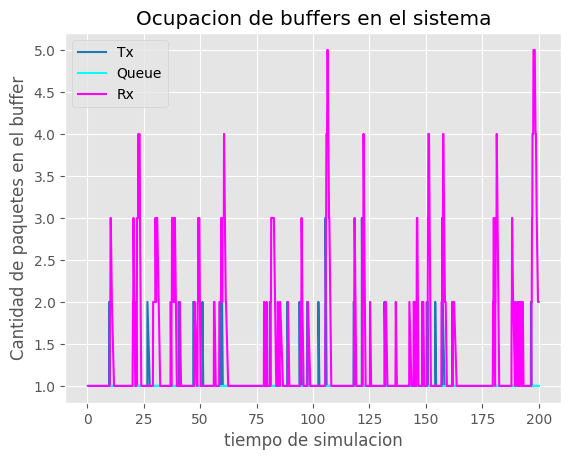
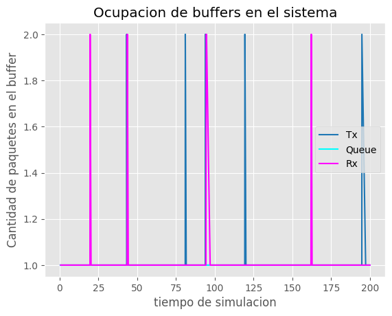

# Estructura del informe:

## TITULO: Analisis de flujo y congestion de redes utilizando simulacion discreta

---

## Astract resumen:
dos parrafos de resumen del trabajo y los resultados
Se nos proporcionó por la catedra un kickstarter de modelo de colas con un generador, una cola y un consumidor. Nuestra primer tarea fue realizar los cambios al codigo para transformar este modelo a uno que tenga en cuenta el tamaño de los paquetes y los buffers (tanto en los hosts como en los nodos intermedios). Y se nos plantearon dos casos a analziar:
	- Caso 1 (**Flujo**): La velocidad para procesar los paquetes entrantes del nuevo consumidor (NodeRx) es menor a la velocidad a la que el nuevo nodo generador (NodeTx) le envía.
	- Caso 2 (**Congestion**): La velocidad y la capacidad de carga de la subred, representada por Queue, limita la cantidad de paquetes.
En ambos casos ocurre la perdida de paquetes.
2) Para solucionar este problema implementamos el siguiente algoritmo
# explicar que hicimos
---

## Introducción: 
definimos el problemas (congestion y flujo). Referencias a otros articulos que abordan el mismo problema

Antes de hablar de estos dos casos tenemos que ver de que se trata cuando hablamos de problema de flujo y de congestión.

El problema de flujo se refiere al caso donde un host transmisor rápido sobrecarga aun host receptor lento. Este problema se trata también en la capa de enlace, pero de una manera distinta, ya que esta capa se encarga de 'proteger' los paquetes mientras viajan a traves de un enlace y no mientras se encuantran dentro de un router. A nivel de capa de transporte nos interesa la fiabilidad de los datos, tratando de manejar la perdida y corrupción de paquetes se entreguen.

Para verificar la entrega de paquetes se hace uso de los ACK (Acknowledgment) para verificar la llegada de los paquetes, temporizadores para saber cuanto tiempo esperar a la recepción de los ACK y buffers para poder guardar los paquetes enviado y recibidos. 

Existen dos tipos de control de flujo: control de flujo basado en créditos y control de flujo basado en retroalimentación. El control de flujo basado en créditos implica que el receptor envíe un mensaje al transmisor cuando esté listo para recibir más datos. El transmisor solo envía datos cuando recibe este mensaje. El control de flujo basado en retroalimentación implica que el receptor envíe un mensaje al transmisor indicando cuántos datos puede recibir en ese momento.

Por otro lado, la congestión es un problema que es manejado también por capa de transporte, pero mayoritariamente por la capa de red. La congestión en la red puede ocurrir cuando hay demasiados datos que intentan pasar por una parte de la red. Cuando esto sucede, los paquetes de datos pueden perderse o retrasarse, lo que puede afectar negativamente la eficiencia y el rendimiento de la red. Cuando una subred se encuentra congestionada lo que queremos hacer es bajar el flujo que mandamos por esa subred para descongestionar, o aumentar la capacidad de carga de esa subred.

Hay muchos enfoques a la hora de resolver este problema. Podemos mejorar los enlaces que son saturados frecuentemente (provisioning), también podemos adaptar las rutas a los patrones de tráfico (traffic-aware routing). Y si no es posible aumentar la capacidad de la subred una solución puede ser, por ejemplo en TCP, algunos host disminuirán la tasa de datos, por eso los host tiene mecanismos para detectar congestión.

**El control de congestión se puede lograr mediante técnicas como control de congestión explícito e implícito. El control de congestión explícito implica que el receptor envíe un mensaje al transmisor indicando que la red está congestionada y que debe reducir la velocidad de envío de datos. El control de congestión implícito implica que el transmisor monitorea la congestión en la red y ajusta su velocidad de envío de datos en consecuencia.**

A nivel de capa de transporte existen varios algoritmos para manejar el problema, por ejemplo TCP Talhoe, o TCP Reno. Este último se trata de, una vez iniciada la conexión, se manda paquetes de forma exponencial hasta llegar a un umbral cierta cantidad de paquetes enviados, a partir de ese umbral se envian paquetes de con incrementos lineales. Cuando pierda paquetes (TCP asume que 3 acks duplicados implican una perdida de paquete) se fija el umbral a la mitad y se vuelve a enviar paquetes de forma lineal, esto se sigue repitiendo.

---

## Marco metodologico : 
como vamos a trabajar con nuestro estudio (simulacion discreta). Q es, como se trabaja, ventajas y desventajas, que se propone hacer. 

En este proyecto utilizamos Omnet++ para simular un modelo de colas y analizar la pérdida de paquetes en redes de comunicaciones. 
Omnet++ es un entorno de simulación de sistemas de eventos discretos basado en C++ y utilizado para simular redes informáticas y otros sistemad distribuidos, la razón del por qué usar Omnet++ es que al tratar de modelar y estudiar problemas de red en capas inferiores (transporte, red y enlace) sería muy complicado la tarea de análisis y desarrollo de la aplicación en si, por esto es que nos apoyamos en Omnet++. Para entender mejor cómo funcion la simulación, es importante conocer algunos conceptos básicos sobre la simulación discreta.

La simulación discreta es una técnica utilizada para modelar y analizar sistemas dinámicos, en donde el tiempo se avanza en forma discreta, es decir, por medio de eventos que ocurren en momentos específicos del tiempo. Esto no da la posibilidad de estudiar en que ocurre entre estos eventos en nuestro sistema, por ejemplo si definimos nuestros eventos a un micro segundo de distancia, sería muy difícil estudiar que sucede dentro de un procesador en esos intervalos, sin embargo en, nuestra simulación podríamos tomarnos mucho tiempo y cómputo entre estos intervalos para saber que sucede en el sistema. Esto nos permite un alto nivel de detalle a la hora de análisis. Inversamente también nos facilita el estudio en modelos donde los eventos se distancian por un gran intervalo.

En nuestro sistema el tiempo de simulación avanza por medio de una cola de eventos de distintos tipos (por ejemplo de eventos de arribo, partida, servicio, etc). El estado del sistema puede cambiar entre eventos, los eventos pueden crear otros y agregarlos en la cola en algun tiempo determinado. 

|                           Ventajas                           |                         Desventajas                          |
| :----------------------------------------------------------: | :----------------------------------------------------------: |
| **Flexibilidad:** Los modelos de simulación de eventos discretos son muy flexibles y pueden adaptarse fácilmente a una amplia variedad de sistemas y situaciones. Pueden modelar eventos y procesos complejos en detalle. | **Complejidad del desarrollo:** El desarrollo de un modelo de simulación de eventos discretos puede ser complejo y requerir un conocimiento profundo del sistema que se está modelando. Requiere la especificación detallada de entidades, eventos, interacciones y reglas de comportamiento. Notar que la precisión de los resultados dependerá en gran medida de la calidad del modelo utilizado, por lo que es importante asegurarse de que este sea lo más fiel posible al sistema real. |
| **Representación detallada del sistema:** Estos modelos pueden representar con precisión los detalles y la complejidad de un sistema. Pueden incluir múltiples entidades, interacciones entre ellas, recursos, eventos y variables que cambian con el tiempo. | **Recursos computacionales:** Los modelos de simulación de eventos discretos pueden requerir una gran cantidad de recursos computacionales, especialmente cuando se simulan sistemas complejos y grandes. Esto puede afectar la velocidad de ejecución y requerir hardware potente para obtener resultados en un tiempo razonable. |
| **Experimentación y análisis:** La simulación de eventos discretos permite realizar experimentos en un entorno controlado y reproducible. Esto permite probar diferentes configuraciones, estrategias y políticas sin afectar el sistema real. Además, proporciona una base sólida para el análisis de resultados y la toma de decisiones informada. | **Validación y verificación:** La validación y verificación de un modelo de simulación de eventos discretos puede ser un desafío. Es necesario asegurarse de que el modelo refleje con precisión el sistema real y de que los resultados de la simulación sean confiables y representativos. |
| **Escalabilidad:** Estos modelos son escalables y pueden adaptarse a sistemas de diferentes tamaños y complejidades. Pueden simular desde sistemas pequeños hasta sistemas extremadamente grandes y complejos, lo que los hace adecuados para una amplia gama de aplicaciones. | **Limitaciones en la representación del tiempo:** Algunos modelos de simulación de eventos discretos pueden tener limitaciones en la representación del tiempo. Por ejemplo, pueden no capturar adecuadamente eventos simultáneos o eventos que ocurren en intervalos de tiempo muy cortos. |
| **Visualización y comprensión:** Los modelos de simulación de eventos discretos a menudo ofrecen herramientas de visualización que permiten observar la simulación en tiempo real. Esto facilita la comprensión del comportamiento del sistema y la identificación de posibles cuellos de botella o áreas problemáticas. |                                                              |

En este proyecto se nos proporciona un kickstarter de un modelo de colas sensillo, en el cual contamos con un módulo *Generador*, una *Cola* y un *Consumidor*. En primera instancia se nos pide cambiar este modelo para que sea más completo y tenga en cuenta la nocion de capacidad, es decir la tasa de transferencia de datos y la memoria de los buffers. 
Agregamos dos nuevos módulos, cada uno compuesto del módulo Generador y Consumidor anteriores. y modificaos la *Network* en base a estos nuevos cambios. Los casos de estudio que se explicarán en detalle más adelante se ajustan en el nuevo nodo Consumidor y en la red.
Luego de analizar los datos en este modelo. Tendremos que implementar nuevas mejoras para diseñar un sistema de control de flujo y congestión entre el consumidor y el generador, para evitar la pérdida de datos por la saturacion de los buffers. Las modificaciones serán detalladas más adelante.

---

## Presentacion de Casos describiendo modelos (con graficas)

- Que diferencia observa entre el caso de estudio 1 y 2? Cual es la fuente limitante en cada uno? Investigue sobre la diferencia entre control de flujo y control de congestion (Figura 6-22 Tanenbaum)

Mati: podemos pensar al sink como un proceso que se encarga de manejar los paquetes que llegan y en el caso 1 es lento.
En el caso 1 de estudio, se presenta un problema de control de flujo. Esto debido a que el host receptor tiene una capacidad de almacenamiento de paquetes pequeña para la capacidad de envío del productor. Como resultado, el host receptor pierde paquetes cuando su buffer se llena y no tenga capacidad de almacenar nuevos paquetes entrantes ni de procesar los ya almacenados para liberar espacio en el buffer.

En la simulacion realizada en omnet++ este tipo de comportamiento se puede observar mediante las estadisticas, los siguientes graficos muestran la evolucion de la ocupacion de cada uno de los buffers a medida que pasa el tiempo.

los graficos fueron generados con intervalos de generacion de exponencial(x) con x [0.1 , 0.2 , 0.3, 0.6, 1] respectivamente

​							
​							

Por otro lado, en el caso 2 de estudio, el problema es de congestión. El emisor tiene una alta capacidad para producir, pero la capacidad de carga de la subred (q es subred) no soporta este tráfico de datos. El nodo Queue no tiene la suficiente capacidad para almacenar y procesar los paquetes que NodeTx le manda. Es por esto que la pérdida de paquetes ocurre en Queue.

Ambos problemas llevan al mismo resultado, la pérdida de paquetes. Pero podemos observar que la razón, y en algunos casos la solución, no es la misma. En la imagen podemos ver una representación de ambos problemas. Donde el dibujo **a)** representa el problema de flujo del caso 1 y el **b)** el problema de congestión del caso 2. Podemos decir que la diferencia fundamental entre estos casos es que el problema de control de flujo se refiere a la velocidad a la que se envían los datos, mientras que el control de congestión se refiere al manejo del tráfico en una red para evitar la congestión.

---

## Metodo: 
Preguntas:|

- Como cree que se comporta su algoritmo de control de flujo y congestion? Funciona para el caso de estudio 1 y 2 por igual? Por que?

 En caso de implementar control de flujo y control en una sola estrategia, se recomienda evaluar el
sistema con un tamaño de buffer de 100 paquetes en la queue conectando el transmisor y receptor. Este
escenario permitirá estudiar el algoritmo con ambas funcionalidades operando simultáneamente.

describe el algoritmo que queremos implementar para resolver estos conflictos de flujo y congestion. Y pq creemos que lo solucionara

---

## Resultados:
detalle de los resultados de los algoritmos diseñados y una pequeña conclusion.

---

## Discusion:
Logros, limitaciones y posibles mejoras del algoritmo propuesto.

---

## Referencias: 
Bibliografia (indicando autor), si es una pagina cuando la usamos (referencia al momento de verla)

## Bibliografía

- Andrew S. Tanenbaum 5ta Edición. *Computer Networks* . Ed. Pearson

- Autor, B. (Año). *Título del capítulo o sección.* En A. Autor (Ed.), Título del libro (pp. xx-xx). Editorial.

- Página web. *Título de la página.* Fecha de acceso. URL.

